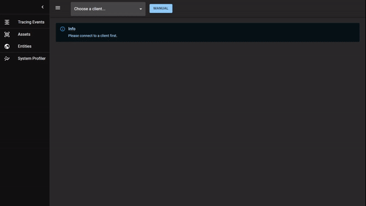

# bevy-remote-devtools



A toolset that allows you to debug / view any bevy application with a tauri based UI.

## Features

- Remote Connection to the bevy client over network with automatic discovery.
- Event tracing viewer to show the current tracing event logs.
- Assets browser that lets you view current loaded Assets (Mesh support only right now)
- Entity browser where you can see all entities in their nested structure and components.
- System profiler that allows you to trace `n` frames and outputs execution times.

## Usage

Install and configure the plugin in your target bevy app:

```toml
bevy-remote-devtools-plugin = "0.1"
```

```rust
app
  .add_plugin(RemoteDevToolsPlugin::new("My App", 3030))
  // RemoteDevToolsPlugin will replace bevys LogPlugin with a similar implementation.
  .add_plugins_with(DefaultPlugins, |group| group.disable::<LogPlugin>())
```

After starting your application you can now anytime connect with the UI app to your app.

Check the latest github release for binaries of the Tauri UI app or continue reading the readme to build it yourself.

## Identify entities

By default your entities are shown with the entities id. Depending on your setup this can make it really though to identify your entities easily. For this you can add the `DevInfo` component to have your entity named and also extend it with a couple of further debug infos like its module path where it was spawned / created. See the example in `/plugin/examples/3d.rs`.

```rust
  commands
      .spawn_bundle(PbrBundle { ... })
      .insert(dev_named!("MyNamedEntity"));
```

## Adding support for custom components.

To be able to view your own components it's enough to add bevys `Reflect` trait and register your component as a type.

```rust
#[derive(Component, Reflect, Default)]
#[reflect(Component)]
pub struct MyComponent {
    velocity: Vec3,
}
```

```rust
app.register_type::<MyComponent>();
```

## Development on the Tauri UI

### Setup

Follow the [Tauri setup docs](https://tauri.studio/docs/getting-started/intro/) in your platform to get everything set up for Tauri development, then run

```bash
$ yarn
```

### Build

```bash
$ yarn build
```

Tauri will walk you through the rest.
